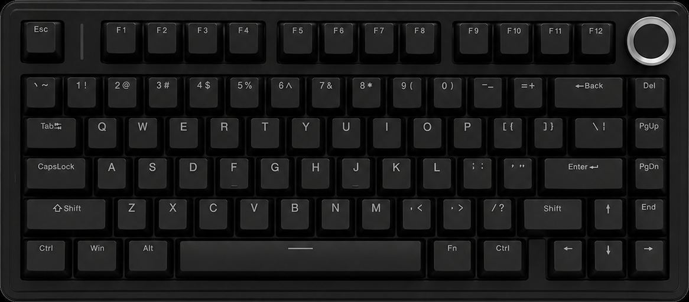
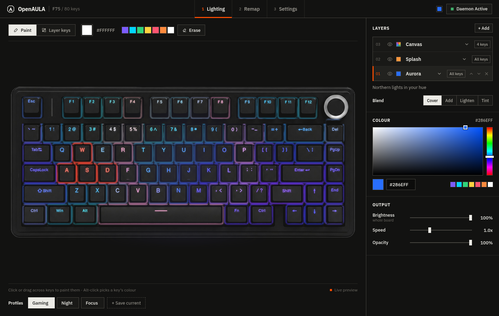
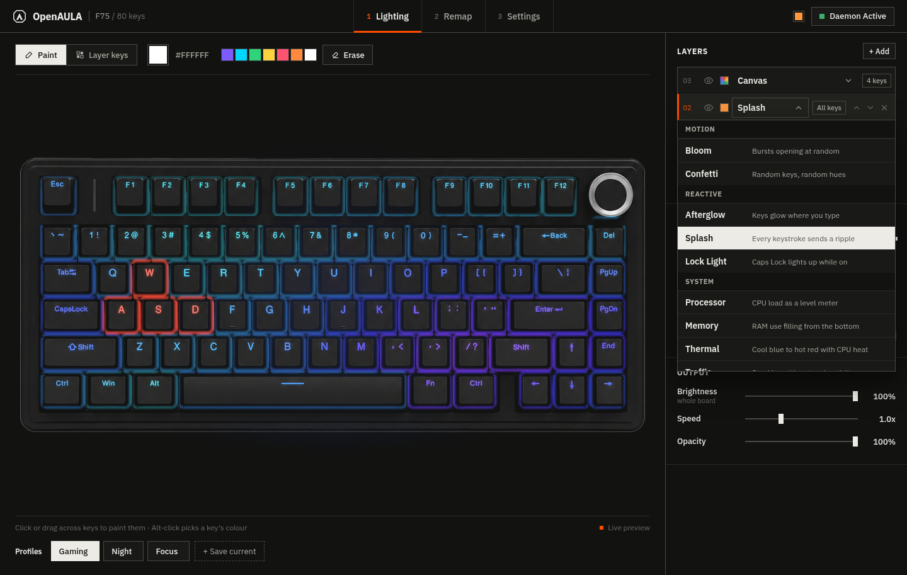
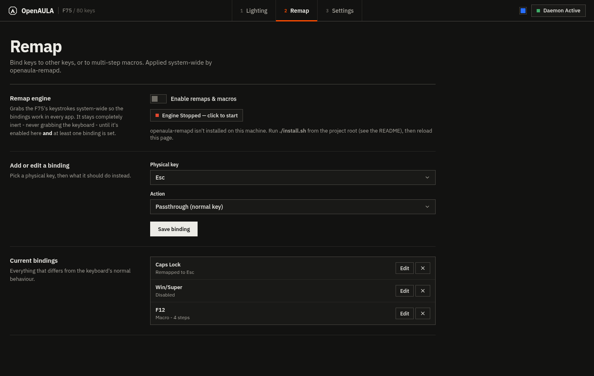
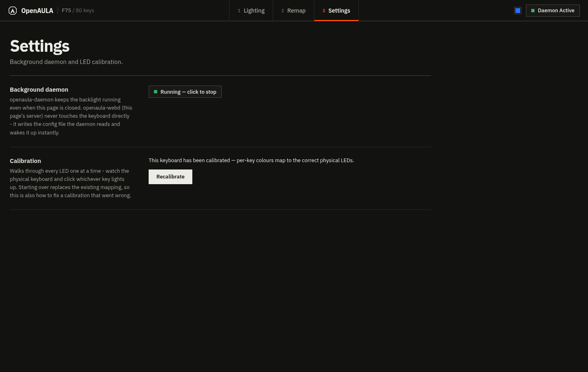

<p align="center">
  
</p>

<h1 align="center">OpenAULA</h1>

<p align="center">
  An open-source lighting &amp; macro driver for the Aula F75 mechanical keyboard,<br>
  controlled entirely from your browser. There is no desktop app to install — the web app <em>is</em> the app.
</p>

<p align="center">
  
  
  
</p>

---

## Contents

- [How it works](#how-it-works)
- [Screenshots](#screenshots)
- [Quick start](#quick-start)
- [What the installer does](#what-the-installer-does)
- [Running without installing](#running-without-installing)
- [Lighting layers & effects](#lighting-layers--effects)
- [Macros & key remaps](#macros--key-remaps)
- [Known limitations](#known-limitations)
- [Uninstalling](#uninstalling)
- [Requirements](#requirements)

## How it works

OpenAULA is split into small, single-purpose pieces that all share one dependency-free
C++ core, so lighting, remapping, and the web UI can never drift out of sync with each
other:

```
 browser  <--HTTP-->  openaula-webd  <--files + SIGUSR1-->  openaula-daemon  <--hidraw-->  keyboard (lighting)
  (web/)                (bridge)                             openaula-remapd  <--evdev/uinput--> keyboard (remaps/macros, optional)
```

| Piece | What it is |
|---|---|
| **`core/`** | Qt-free, dependency-free C++: HID protocol, keyboard layout, lighting animation math, profile/state persistence. Linked into everything below. |
| **`daemon/`** | `openaula-daemon` — a small background process that owns the keyboard's `hidraw` connection and drives the backlight. Also builds `openaula-remapd`, a separate opt-in process for key remaps/macros. |
| **`bridge/`** | `openaula-webd` — an HTTP server with zero Qt/GUI dependencies. Serves `web/`, exposes a small JSON API that reads/writes the same state files `openaula-daemon` reads, and nudges it with `SIGUSR1` so changes apply instantly. It never touches the keyboard's HID device directly. |
| **`web/`** | The app itself — lighting control, profiles, and the Macros & Remap editor, all running in your browser. |

Everything here is **Linux-only** (`hidraw` / `evdev` / `uinput`).

## Screenshots

**Lighting** — the live preview of the board (lit legends and the glow under the caps, as on the real keyboard), the paint tool above it, profiles below, and the layer inspector on the right.

<p align="center"></p>

**Effects** — every layer picks from one grouped list: still, ambient, motion, reactive (driven by your typing) and system (driven by CPU, memory, temperature, network or the clock).

<p align="center"></p>

**Remap** — bind any physical key to another key, disable it, or attach a multi-step macro, all applied system-wide by `openaula-remapd`.

<p align="center"></p>

**Settings** — daemon status and calibration in one place.

<p align="center"></p>

## Quick start

```sh
git clone https://github.com/cvsqwe/OpenAula
cd OpenAULA
./install.sh
```

That builds everything and installs `openaula-daemon` and `openaula-webd` as systemd
`--user` services that start automatically on login. When it finishes it prints the URL
to open — normally either:

- `http://aula.settings/`, if the installer's optional hostname step succeeded (see
  below), or
- `http://localhost:8787/` otherwise.

`./install.sh` needs `sudo` for exactly one thing structurally (installing the udev rule
below) and one more thing best-effort (binding port 80); it will prompt for your
password when it gets there. Nothing it does requires running as root on an ongoing
basis — both services run as your normal user.

It's safe to re-run `./install.sh` any time, e.g. after `git pull` — every step is
idempotent (rebuilds, re-copies, re-enables; it won't duplicate a udev rule or an
`/etc/hosts` line that's already there).

## What the installer does

1. **Builds** the project with CMake into `build/`.
2. **Installs a udev rule** (`daemon/60-openaula.rules`) to `/etc/udev/rules.d/`. This
   grants the currently logged-in desktop user direct access to the keyboard's `hidraw`
   interface (lighting) via systemd-logind's `uaccess` mechanism — the same mechanism
   udev's own bundled rules use for things like Steam controllers. No group membership,
   setuid binary, or running anything as root is involved; access is tied to your login
   session and revoked on logout. This is the one system-wide file the installer
   touches.
3. **Installs and starts `openaula-daemon`** as a `systemd --user` service
   (`~/.config/systemd/user/openaula-daemon.service`), enabled so it starts
   automatically on every login.
4. **Installs and starts `openaula-webd`** the same way, plus copies `web/` to
   `~/.local/share/openaula/web`.
5. **Best-effort friendly hostname.** Runs
   `sudo setcap 'cap_net_bind_service=+ep' ~/.local/bin/openaula-webd` so the bridge can
   bind port 80 without running as root, adds `127.0.0.1 aula.settings` to
   `/etc/hosts`, and points the installed service at port 80. If the `setcap` call fails
   for any reason (no sudo, a filesystem without extended-attribute support, etc.) the
   installer just leaves everything on the default port 8787 — nothing else depends on
   this step working.
6. **Installs `openaula-remapd`** (the key remap/macro engine) *if*
   `libevdev-dev`/`libevdev-devel` was installed when CMake ran — otherwise it's skipped
   with a note telling you what package to install. Unlike the other two, this one is
   **not started or enabled**. Turn it on from the web app's **Macros & Remap** page
   once you've read the section below.

If you only want one piece (e.g. you're developing and just want to rebuild
`openaula-webd`), the individual scripts still work standalone: `daemon/install.sh`,
`bridge/install.sh`, `daemon/install-remap.sh`. Note that re-running `bridge/install.sh`
directly copies a fresh binary and does **not** re-apply the port-80 capability from
step 5 (a plain file copy doesn't carry that over) — if you update just the bridge that
way and were using `aula.settings`, re-run the top-level `./install.sh` afterwards to
reapply it (it's cheap and safe to repeat).

## Running without installing

For development, or if you'd rather not install anything system-wide:

```sh
cmake -S . -B build && cmake --build build -j
./build/openaula-daemon &          # drives the backlight
OPENAULA_WEB_PORT=8787 ./build/openaula-webd &   # serves web/ + the API
```

Then open `http://localhost:8787/`. `openaula-webd` finds `web/` relative to its own
binary automatically when run this way (`build/../web`), or you can point it elsewhere
with `OPENAULA_WEB_ROOT=/path/to/web`.

Both processes read/write plain files under `~/.config/openaula/` (`state.conf`,
`profiles.conf`, `remap.conf`) — nothing is stored in a database or requires network
access beyond your own machine.

## Lighting layers & effects

The backlight is a **stack of layers**, composited bottom to top — so different keys can
run different effects, or several effects can share the same keys. Each layer has its
own effect, colour, speed, opacity, set of keys, and blend mode:

- **Cover** — replaces what's below it.
- **Add** — light adds up.
- **Lighten** — the brighter colour wins.
- **Tint** — multiplies what's below (e.g. a white Breath over a Canvas makes the painted
  keys breathe).

Tools above the keyboard:

- **Paint** — click or drag across keys to colour them with the brush (any colour, or
  Alt-click a key to pick up its colour). Paint lands on the topmost **Canvas** layer,
  which is created automatically the first time you paint; **Erase** removes keys from it
  again so the layers below show through.
- **Layer keys** — choose which keys the selected layer covers, by clicking/dragging or
  with presets (Letters, Numbers, F-row, WASD, Arrows, Modifiers, Nav, Invert…).

Effects come in five groups:

| Group | Effects |
|---|---|
| Still | Canvas, Horizon, Blackout |
| Ambient | Breath, Aurora, Starfield, Pulse, Chroma, Prism, Vortex, Ember |
| Motion | Tide, Pendulum, Echo, Rain, Cascade, Meteor, Serpent, Wipe, Checker, Flash, Bloom, Confetti |
| Reactive | Afterglow, Splash, Lock Light — driven by real keystrokes |
| System | Processor, Memory, Thermal, Traffic, Clock — driven by the machine |

Reactive effects read the F75's own input device **read-only** (it is never grabbed, so
typing is unaffected); system effects read `/proc` and `/sys` (CPU load, memory, CPU
temperature, network throughput) and the local clock. Both run inside
`openaula-daemon`, so they keep working with the browser closed. The browser preview
shows the same metrics, and previews the reactive effects from keys typed while the page
has focus.

Settings saved before layers existed are converted automatically on first load.

## Macros & key remaps

The **Remap** tab is the web UI for key
remapping, backed by the `openaula-remapd` engine and the `core/RemapConfig` file
format.

For each physical key on the board you can choose:

- **Passthrough** — behaves normally (the default for every key).
- **Disabled** — the key press is swallowed and does nothing.
- **Remap to another key** — pick a target key from the dropdown; every press/release of
  the physical key is translated to that key instead.
- **Play a macro** — a list of press/release steps, each with its own delay afterwards,
  replayed once per physical press (holding the key down or its auto-repeat does not
  replay the macro).

Click **Edit** on an existing binding in the list to load it back into the form above,
change it, and save again; **Save binding** always creates-or-replaces whichever
physical key is currently selected.

**Read this before flipping "Enable remaps & macros" on:** `openaula-remapd` works by
finding the F75's keyboard input device, **grabbing it exclusively** (the standard
technique tools like `keyd`/`interception-tools` use), and re-emitting every keystroke
itself through a virtual device — translating, dropping, or expanding into a macro along
the way. That's what makes remaps work system-wide (any app, any window) instead of only
inside a browser tab, but it also means a bug in it can make typing stop working until
the process is killed. It's a **separate process from `openaula-daemon`** specifically
because of this extra risk — a crash here can't take lighting down with it, and you can
choose not to install it at all.

If typing ever stops working:

```sh
systemctl --user stop openaula-remapd
# or, from another device/TTY if that shell is also stuck:
pkill -x openaula-remapd
```

The grab is released the instant the process exits, restoring normal typing
immediately. The engine also stays completely inert — it never grabs the keyboard at
all — until it's both enabled **and** has at least one binding configured, so installing
it is not itself risky.

## Known limitations

- **Reactive effects go dark while remaps are enabled.** `openaula-remapd` grabs the
  keyboard exclusively, so `openaula-daemon` no longer sees its keystrokes.

- **No calibration UI walkthrough beyond the Settings page.** If your board reports as
  uncalibrated (see Settings), per-key custom colours may land on the wrong physical
  keys until recalibrated.
- **`http://aula.settings/` is local-machine-only.** It's a plain `/etc/hosts` entry
  pointing at `127.0.0.1`, not real DNS — it only resolves on the machine
  `./install.sh` ran on, and only in browsers that read the system hosts file (which is
  all mainstream desktop browsers).

## Uninstalling

```sh
systemctl --user disable --now openaula-daemon openaula-webd openaula-remapd
rm -f ~/.local/bin/openaula-daemon ~/.local/bin/openaula-webd ~/.local/bin/openaula-remapd
rm -f ~/.config/systemd/user/openaula-{daemon,webd,remapd}.service
rm -rf ~/.local/share/openaula
systemctl --user daemon-reload

sudo rm -f /etc/udev/rules.d/60-openaula.rules
sudo udevadm control --reload-rules

# Only if you used the aula.settings hostname:
sudo sed -i '/aula\.settings/d' /etc/hosts
```

Or just run `./uninstall.sh`, which does the same thing.

Your saved lighting/profile/remap config in `~/.config/openaula/` isn't touched by any
of the above — remove it too if you want a completely clean slate.

## Requirements

- Linux with systemd (for autostart; everything still runs fine without it, see
  [Running without installing](#running-without-installing))
- CMake 3.16+, a C++17 compiler, `hidapi-hidraw`, `pthread`
- Optional: `libevdev-dev`/`libevdev-devel` if you want `openaula-remapd` (key
  remaps/macros)
- A browser — no separate GUI toolkit is needed
